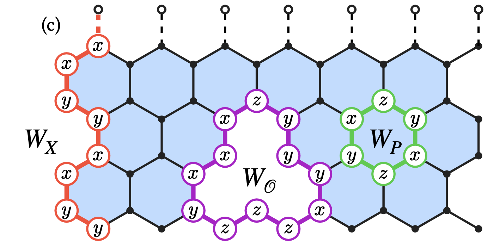

<!-- #  -->
# Kitaev.jl
Kitaev.jl is a high-performance tensor network framework for simulating the Kitaev honeycomb model and its generalizations. Built on top of [ITensors.jl](https://docs.itensor.org/ITensors/stable/), this package enables scalable and accurate studies of strongly correlated quantum spin systems, with a focus on topological order and non-Abelian anyons.

- Efficient mapping of honeycomb cylinders to one-dimensional chains, leveraging matrix product state (MPS) representations
- Supports simulation of spin vacancies and flux-bound non-Abelian anyons in extended Kitaev-type Hamiltonians, incorporating anisotropic couplings, Heisenberg exchange, off-diagonal gamma interactions, and an external magnetic field
- Enables simulation of mobile hole dynamics in extended Kitaev-type Hamiltonians, incorporating Kitaev exchange, three-spin interactions, using tJ-type sites 
- Implementation of tailored perturbations and non-local pinning fields to control topological flux sectors and accelerate convergence in symmetry-broken regimes

Kitaev.jl is actively evolving, with planned extensions including real-time and imaginary-time evolution, projected entangled pair state (PEPS) support—targeting applications such as the J₁–J₂ Heisenberg model on the triangular lattice and Abelian quantum spin liquids—and integration with quantum circuit emulation frameworks for benchmarking topological qubit architectures.



## Getting Started

To install the package, use the Julia package manager:

```julia
using Pkg
Pkg.add("Kitaev")
```

For more information and detailed usage examples, please refer to the documentation (coming soon).

---

<!-- *Note: The image path has been updated to assume the image is in the same repository. Ensure the file `Presentation_Fig1c.png` is correctly placed in the repository for proper rendering.* -->
